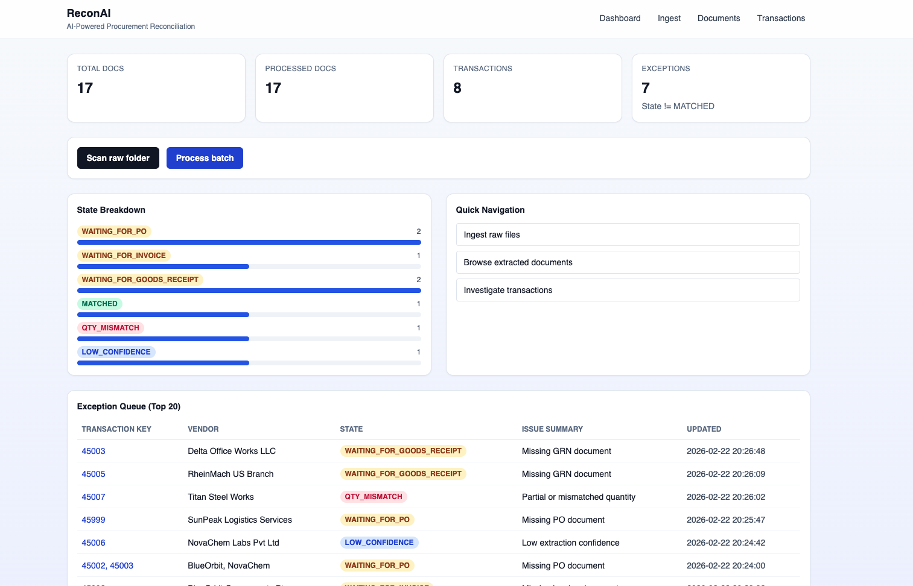
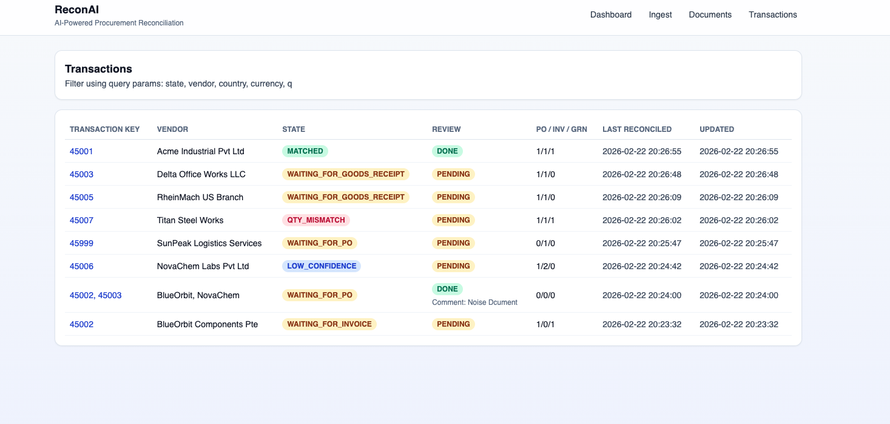
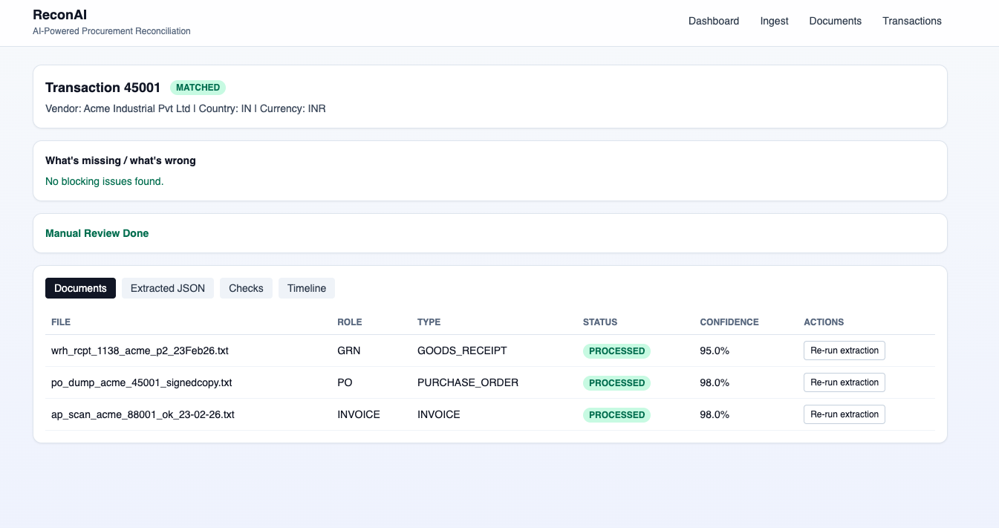
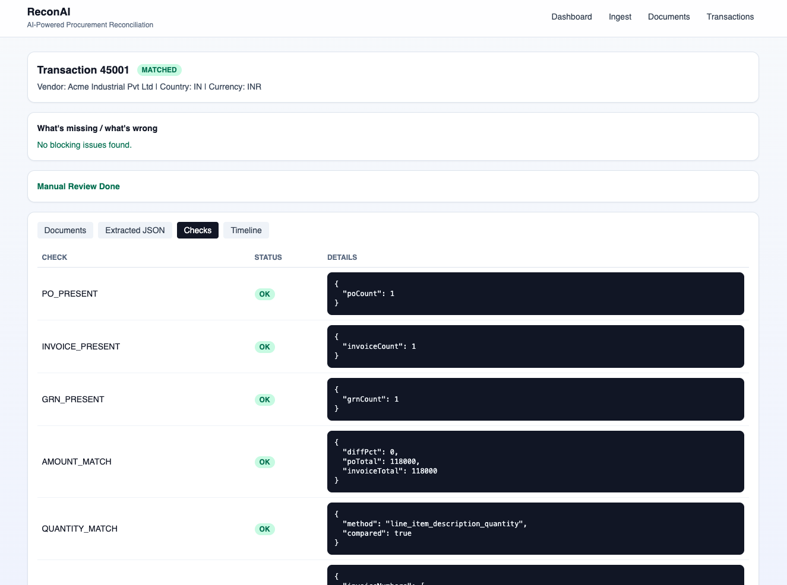
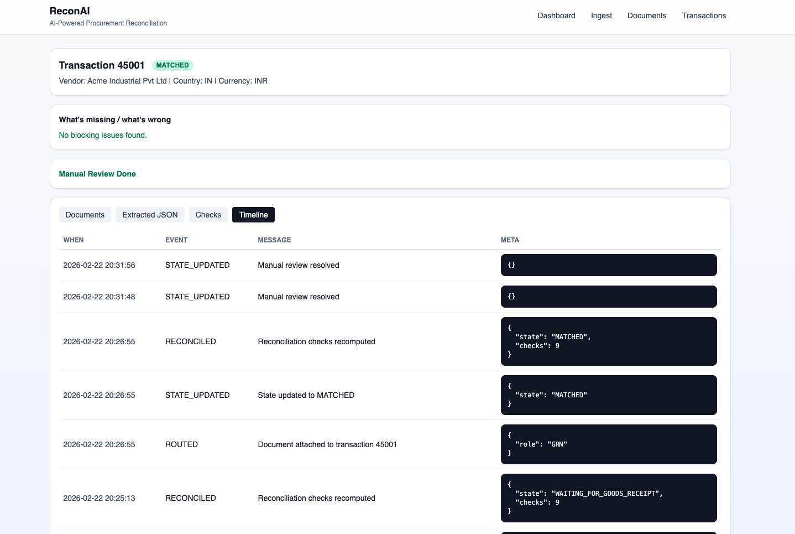

# ReconAI

ReconAI is a full-stack prototype for procurement reconciliation from a chaotic raw data lake.

## Product Walkthrough

### 1) Dashboard: KPI + Exception Queue


### 2) Transactions: State + Review Status


### 3) Transaction Detail: Documents Tab


### 4) Transaction Detail: Checks Tab


### 5) Transaction Detail: Timeline Tab


## Stack

- Next.js App Router + TypeScript
- PostgreSQL + Drizzle ORM + drizzle-kit
- Gemini (`gemini-3-flash-preview`) via Google GenAI SDK (server-side only)
- TailwindCSS


## Setup

1. Install dependencies:

```bash
npm install
```

2. Create env file:

```bash
cp .env.example .env
```

3. Update `.env` values (`DATABASE_URL`, `GEMINI_API_KEY`, etc.).

For Supabase-hosted Postgres:
- Set `DATABASE_URL` to Supabase pooler connection string.
- Set `DATABASE_URL_MIGRATE` to Supabase direct connection string.

Required Supabase storage configuration:
- Set `SUPABASE_URL` + `SUPABASE_SECRET_KEY` (recommended).
- Legacy fallback supported: `SUPABASE_SERVICE_ROLE_KEY`.
- Set `SUPABASE_RAW_BUCKET`, `SUPABASE_STORAGE_BUCKET` and optional prefixes.

4. Run migrations:

```bash
npm run db:migrate
```

5. Start dev server:

```bash
npm run dev
```

Open: `http://localhost:3000/dashboard`

## Raw Data + Storage

- Raw input source: `supabase://<SUPABASE_RAW_BUCKET>/<SUPABASE_RAW_PREFIX>`
- Processed artifacts target: `supabase://<SUPABASE_STORAGE_BUCKET>/<SUPABASE_STORAGE_PREFIX>/transactions/<transactionKey>/...`
  - `.../docs/<originalFileName>`
  - `.../extracted/<documentId>.json`
  - `.../transaction.json`

## Ingestion Flow

- `POST /api/ingest/scan` scans Supabase raw bucket files, computes sha256, and dedupes by hash.
- `POST /api/ingest/process?limit=25` processes backlog synchronously.

CLI equivalents:

```bash
npm run ingest:scan
npm run ingest:process
```

## API Endpoints

- `POST /api/ingest/scan`
- `POST /api/ingest/process?limit=25&retryFailed=1`
- `POST /api/storage/upload-raw`
- `GET /api/storage/transactions/[transactionKey]/download`
- `GET /api/documents`
- `GET /api/transactions`
- `GET /api/transactions/[id]`
- `POST /api/transactions/[id]` (actions: rerun extraction, resolve review)
- `GET /api/reports`
- `GET /api/health`

## Tests

```bash
npm test
```

Includes tests for:
- transaction state machine
- amount tolerance matching
- duplicate invoice detection

## Notes

- If `GEMINI_API_KEY` is missing, extraction falls back to a deterministic heuristic parser for local demo continuity.

## Render + Supabase Deploy

Set these environment variables in Render service settings:
- `DATABASE_URL` (Supabase pooler URI, with `sslmode=require`)
- `GEMINI_API_KEY`
- `SUPABASE_URL`
- `SUPABASE_SECRET_KEY` (recommended)
- `SUPABASE_SERVICE_ROLE_KEY` (legacy fallback)
- `SUPABASE_RAW_BUCKET`
- `SUPABASE_STORAGE_BUCKET`
- `SUPABASE_RAW_PREFIX`
- `SUPABASE_STORAGE_PREFIX`
- optional: `GEMINI_MODEL`, `PROCESS_BATCH_SIZE`, `CONFIDENCE_THRESHOLD`, `AMOUNT_TOLERANCE_PCT`

For migrations in CI (GitHub Actions), set:
- `DATABASE_URL_MIGRATE` (Supabase direct DB URI, with `sslmode=require`)

### GitHub Action for Supabase Migrations

- Workflow file: `.github/workflows/db-migrate.yml`
- Triggers:
  - Manual: GitHub -> Actions -> `DB Migrate` -> `Run workflow`
  - Auto on push: when DB/migration files change on `main`/`master`

Required GitHub secret:
- `DATABASE_URL_MIGRATE`
  - Add in GitHub -> Repo -> Settings -> Secrets and variables -> Actions -> New repository secret

Where to find migrate URL in Supabase:
- Supabase Dashboard -> Project Settings -> Database -> Connection string
- Copy the **Direct connection** URI (not the pooler URL), then append `?sslmode=require` if not already present.
- Typical format:
  - `postgresql://postgres:<PASSWORD>@db.<project-ref>.supabase.co:5432/postgres?sslmode=require`
